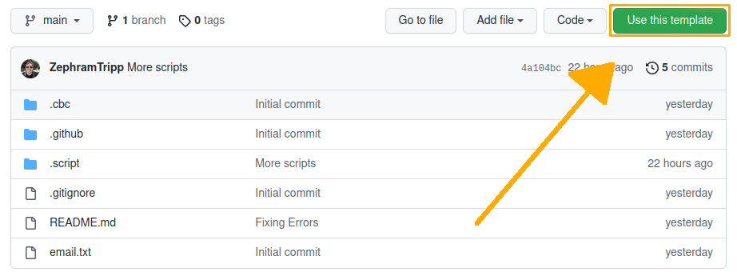
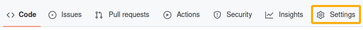
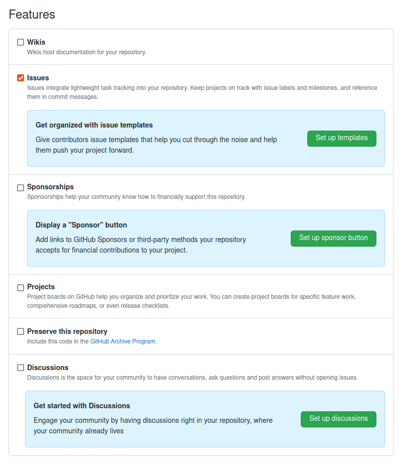
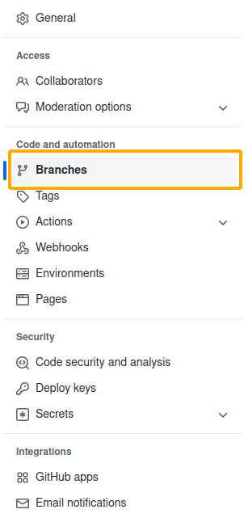
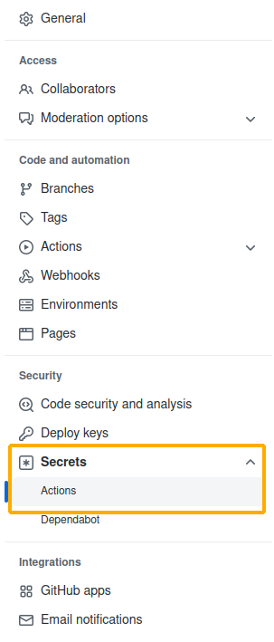
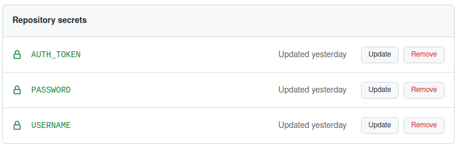
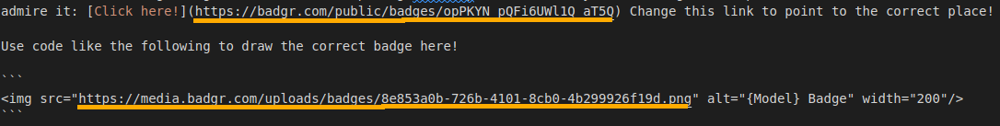

# How To Use The Model Repo

In order to simplify the process of creating new badge repos, we've developed this template repository. There are two main ways use can use this repository, and I'll go over both here. Perform all these steps while logged in to the BYUComputingBootCampTests account. Get login credentials from Daniel Butterfield in Professor Mangelson's lab or Zephram Tripp in the CCL. This tutorial also assumes you're using a Linux-based filesystem. It make take extra effort to use on a non-Linux system. You will also need to have the utility "sed" installed.

## Use This Template

On Github, there's a big green "Use this template" button in the top right corner. 

If you click this button, it will generate a repository that is a copy of this one. Make sure to name your new repo after the name of the subject matter being tested, followed by “Test”. For example, if I wanted to make an automated test for the Python sub-module, I would name my repository “pythonTest”.

You will need to complete the following steps, after copying the repo:

1. Go to the Settings tab. 

From here, change your Features menu to have only Issues selected. We don’t need the other features, and they might just end up confusing the user.

2. While still in Settings, go to the Branches tab on the left.

Add a new rule for branch pattern "main" to "Require pull request reviews before merging" and "Require review from Code Owners". This will stop the users from merging pull requests without our approval, so that the repository can function as designed. However, when you are creating/making edits to the repository, you might want to disable this temporarily to make it easy to push to the repository.

3. While still in Settings, go to the Secrets tab on the left. 

Add three secrets, one for the Badgr.com username as USERNAME, one for the password as PASSWORD, and one for the GitHub authentication token as AUTH_TOKEN. Contact Daniel Butterfield in Professor Mangelson's lab or Zephram Tripp in the CCL to get this information. This is also where you'll make secrets for expected output to compare against for your test cases.

4. Clone the repo onto your local machine. 

5. Run the templateSetup.sh script in the .script directory from the main repo directory, using the following format:

` source ./.script/templateSetup.sh [lowercase repo name] [uppercase repo name] `

For example, if my new repo were named pythonTest, I would run:

` source ./.script/templateSetup.sh python Python `

This will set you up to have everything named properly in the Javascript code.

6. In .cbc/badgeAPI.js, there will be a variable on line three called {RepoName}BadgeEntityID. You need to set this variable equal to your badge's Badgr.com ID. To get the ID of the badge you want to reward, go to the Badgr page for the badge. The URL for the page will be of the form “https://badgr.com/public/badges/<BadgeEntityId>”, so just copy the slug from the URL and past it into this spot.

7. Change README.md. Replace the links in the README.md that point to the Badgr page and the badge image file to point to the proper page and image files for your repo. 

Then your setup will be complete! Your next step will be to add tests to the {RepoName}Test.yml file in your workflows directory. There are sections to add both tests and the failure printouts for each one. Check out the makeTest repo here: [make Test](https://github.com/BYUComputingBootcampTests/makeTest) for an example. Good luck!

## Use a Script

If you'd like to avoid using a template repo at all, we've provided a script that will set up all the Github things for you. From the account, create a new repo, using the above mentioned naming convention. Then copy badgeSetup.sh from the .script directory in this repo onto your local machine. Set it to be an executable using your preferred method. Run the script using the following format:

` badgeSetup.sh [lowercase repo name] [uppercase repo name] `

For example, if my new repo were named pythonTest, I would run:

` badgeSetup.sh python Python `

This will clone the repo from GitHub, set up all the files to be the way they should, and prepare to go through steps 1, 2, 3, 6, and 7 of the previous method. You will then be equally ready to begin the test creation process. Good luck!